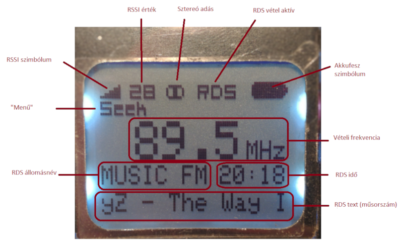
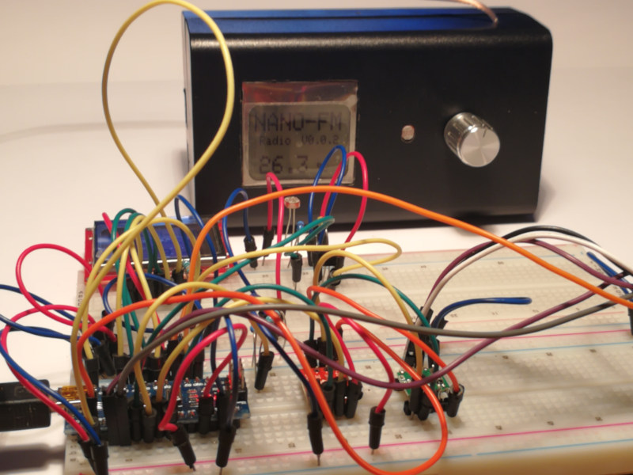

# ArduinoFmRadio
Arduino FM rádió RDA5807M modullal és ATmega328P mikrovezérlővel

Full description of the project: [https://electrodiy.blog.hu/2018/07/27/nano_fm_radio](https://electrodiy.blog.hu/2018/07/27/nano_fm_radio)

